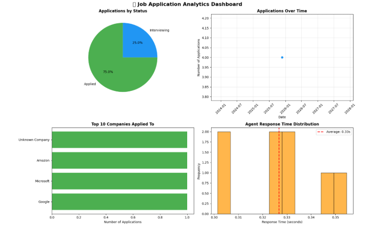

# 🤖 AI Job Application Tracker

<div align="center">


**An intelligent job application tracking system powered by Google's Gemini AI**

[View Demo](#-sample-output) • [Quick Start](#-quick-start) • [Workshop Coverage](#-workshop-coverage-analysis)

</div>

---

**Google AI Agents Intensive - 5 Day Workshop Capstone Project**

An intelligent job application tracking system powered by Google's Gemini AI, built to solve the real-world problem of managing multiple job applications efficiently.

## 🎯 Project Overview

This AI agent helps job seekers:
- 📝 Track all applications in one centralized database
- 🔄 Monitor application status and progress
- 🔍 Research companies quickly
- ⏰ Set automated follow-up reminders
- 📊 Visualize job search analytics

### Why This Project?

After months of job hunting with applications scattered across emails, spreadsheets, and sticky notes, I built this intelligent assistant to streamline my job search process. This capstone project demonstrates practical AI agent development while solving a genuine personal challenge.

### My Journey 🚀

I started the Google AI Agents Workshop knowing basic Python but had never built a complete AI agent before. Over 5 days, I learned how to:
- Design agent architectures
- Integrate tools with LLMs
- Manage state and memory
- Evaluate quality
- Deploy production-ready code

This tracker represents not just what I learned, but a tool I actually need and will use in my own job search!

## ✨ Features

- **Natural Language Interface**: Interact with your job tracker using conversational queries
- **Persistent Storage**: SQLite database maintains complete application history
- **Intelligent Tools**: 7 custom tools for comprehensive job tracking:
  - Save applications with details
  - Query and filter applications
  - Update application status
  - Research company information
  - Generate cover letter drafts
  - Calculate success metrics
  - Set follow-up reminders
- **Performance Monitoring**: Built-in quality metrics and evaluation
- **Visual Analytics**: Interactive charts and statistics dashboard

## 🏗️ Architecture

### Workshop Concepts Demonstrated

| Day | Concept | Implementation | Status |
|-----|---------|----------------|--------|
| 1 | Agent Architecture | JobSearchAgent with Gemini 2.0 Flash | ✅ |
| 2 | Tool Integration | 7 custom tools with function calling | ✅ |
| 3 | Memory & Context | SQLite + conversation history | ✅ |
| 4 | Quality & Evaluation | Metrics tracking & monitoring | ✅ |
| 5 | Production Ready | Error handling + logging | ✅ |

### Tech Stack

- **AI Model**: Google Gemini 2.0 Flash (via API)
- **Database**: SQLite3
- **Visualization**: Matplotlib, Seaborn
- **Data Processing**: Pandas
- **Language**: Python 3.11+

## 🚀 Quick Start

### Prerequisites

```bash
pip install google-generativeai pandas matplotlib seaborn
```

### Setup

1. Clone the repository:
```bash
git clone https://github.com/SaiRitwik11/ai-job-application-tracker.git
cd ai-job-application-tracker
```

2. Set up your Google API key:
```python
# Option 1: Environment variable
export GOOGLE_API_KEY="your_api_key_here"

# Option 2: Kaggle Secrets (if running on Kaggle)
# Configured automatically
```

3. Run the notebook:
```bash
jupyter notebook notebook/ai-job-application-tracker.ipynb
```

### Usage Examples

```python
# Initialize the agent
agent = JobSearchAgent(use_mock=False)  # Set to True for demo mode

# Save a new application
agent.process_query(
    "I applied to Google for a Software Engineer position in Bangalore"
)

# Check your applications
agent.process_query("Show me all my applications")

# Update status
agent.process_query("Update application #1 to Interviewing")

# Set reminder
agent.process_query("Set a reminder for application #2 in 7 days")

# View statistics
agent.process_query("Show my job search statistics")
```

## 📊 Database Schema

### Applications Table
- Basic info: company, role, location, salary range
- Status tracking: Applied, Interviewing, Assessment, Offer, etc.
- Timestamps: applied_date, last_updated, follow_up_date

### Activity Log
- Complete audit trail of all actions
- Timestamps and detailed descriptions

### Metrics Table
- Performance metrics: response times, success rates
- Quality monitoring data

## 🔍 Key Implementation Details

### Intelligent Query Processing

The agent uses pattern matching (in mock mode) or Gemini's NLU (in API mode) to understand user intent:

```python
# Examples of understood queries:
"I just applied to Microsoft for a Data Scientist role"
"Show me applications with status Interviewing"
"What's my success rate?"
"Remind me to follow up with Amazon in 5 days"
```

### Mock Mode

To demonstrate architecture without consuming API quota:
- Uses pattern matching for query understanding
- Executes real tool functions
- Saves actual data to database
- Perfect for testing and demos

```python
agent = JobSearchAgent(use_mock=True)
```

## 📈 Sample Output

```
🎬 DEMO: Saving Job Applications
════════════════════════════════════════════════════════════════════════

Query: I just applied to Google for SWE in Bangalore
──────────────────────────────────────────────────────────────────────

✅ Response (0.35s):

Got it! I've saved your application:
• Company: Google
• Role: Software Engineer
• Application ID: #1

Good luck! I'll help you track this. 🎯
```

### Analytics Dashboard
   
```

## 🎓 Workshop Coverage Analysis

### Day 1: Agent Architecture ✅
- Implemented `JobSearchAgent` class with clean separation of concerns
- State management via conversation history
- Query processing pipeline with tool selection

### Day 2: Tool Integration ✅
- 7 fully functional tools with type hints
- Proper function declarations for Gemini
- Error handling and validation

### Day 3: Memory & Context ✅
- SQLite for persistent storage
- Activity logging for complete audit trail
- Conversation history maintenance

### Day 4: Quality & Evaluation ✅
- Response time tracking
- Success rate calculation
- Tool usage analytics
- Built-in metrics system

### Day 5: Production Ready ✅
- Comprehensive error handling with logging
- Rate limiting considerations
- Database connection management
- Graceful degradation (mock mode)

## 🔮 Future Enhancements

- [ ] Email integration for automated follow-ups
- [ ] Calendar sync for interview scheduling
- [ ] Advanced analytics with ML predictions
- [ ] Web interface using Streamlit/Flask
- [ ] Export to PDF/Excel reports
- [ ] Integration with job boards (LinkedIn, Indeed)
- [ ] Resume tailoring suggestions

---

## 📬 Contact

**Jannu Sai Ritwik**

- LinkedIn: https://www.linkedin.com/in/jannu-sai-ritwik-339749201/
- Email: sairitwik008@gmail.com
- Kaggle:(https://www.kaggle.com/jannusairitwik)

---

## 🤝 Contributing

This is a capstone project, but suggestions and improvements are welcome!

1. Fork the repository
2. Create your feature branch (`git checkout -b feature/AmazingFeature`)
3. Commit your changes (`git commit -m 'Add some AmazingFeature'`)
4. Push to the branch (`git push origin feature/AmazingFeature`)
5. Open a Pull Request

## 📝 License

This project is licensed under the MIT License - see the LICENSE file for details.

## 👤 Author

**Jannu Sai Ritwik**

- Workshop: Google AI Agents Intensive (5 Days)
- Date: November 2025
- Project: AI Job Application Tracker Capstone

## 🙏 Acknowledgments

- Google AI Agents Workshop organizers and instructors
- Google Gemini API team
- Kaggle platform for hosting and compute resources
- Fellow workshop participants for inspiration
---

<div align="center">

### ⭐ If you found this project helpful, please consider giving it a star!

**Built with ❤️ during the Google AI Agents 5-Day Workshop**

</div>
```
